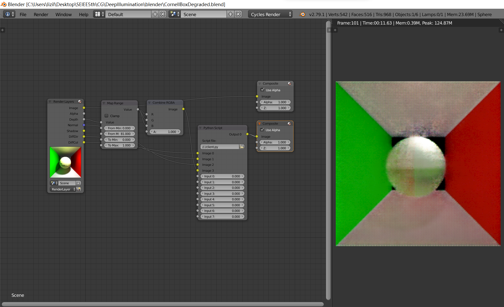
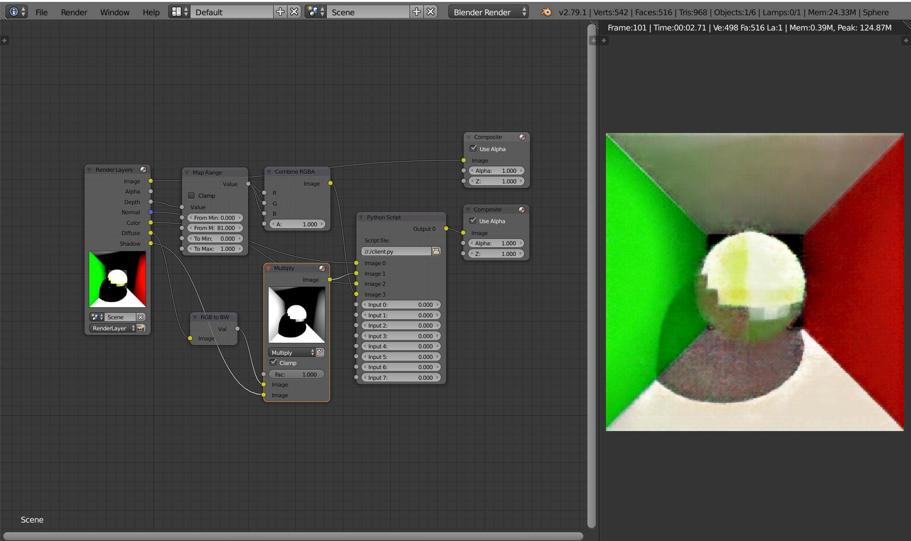

# Blender plugin

This only works for a special customized blender version 2.79
from https://github.com/bitsawer/blender-custom-nodes,
which allows us to make use of Python script on compositing nodes.

You could download the Windows version of modified blender in
https://github.com/bitsawer/blender-custom-nodes/releases/tag/v0.3.0

## Compositing Setup on Cycles

## Compositing Setup on EEVEE

